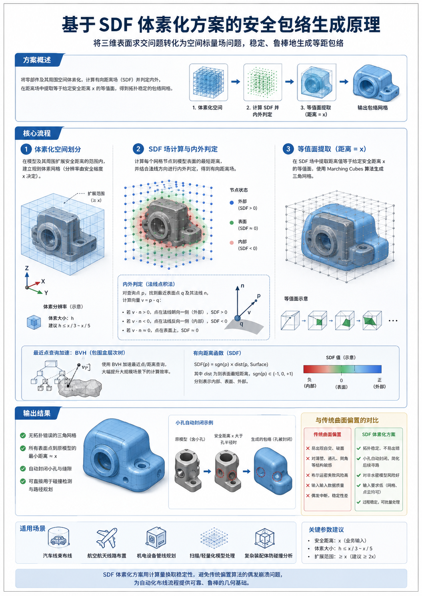

## 3D 空间等距安全包络算法技术说明

### 一、 业务背景

三维电气自动布线系统中，线束的防碰撞与路径规划需要一个前提条件：围绕零部件、按给定安全距离 $x$ 生成等距包络几何体。

传统 B-Rep 内核做向外偏置时，遇到薄壁、通孔、倒角等常见结构容易出错——曲面自交、拓扑破损、布尔运算失败，最终生成中断。这对自动化布线流程来说是不可接受的，因为偏置失败会直接阻断后续所有步骤。

因此本系统采用了另一条路线：**基于 SDF（有向距离场）+ 等值面提取的体素化方案**。

### 二、 技术原理

思路是把三维表面求交问题转化为空间标量场问题，分三步完成：

1. **体素化空间划分**
将零件及周围延展空间划分为大量微观正方体网格（体素），分辨率由安全裕度决定。

2. **SDF 场计算与内外判定**
计算每个网格节点到模型表面的最短距离。工业模型常存在微小缝隙（非水密），单纯的距离值无法判断节点在模型内部还是外部。算法通过表面法线向量点积来做内外判定，对残缺模型和相交面有较好的容错能力。

3. **等值面提取**
用 Marching Cubes 算法在距离场中提取距离值等于 $x$ 的等值面，输出无拓扑错误的网格。

#### 原理图

### 三、 方案优势

与传统曲面偏置相比，SDF 体素化方案的主要优势：

* **拓扑稳定性好**
不依赖原始曲面的连续性和光滑性，对自交、锐角、退化面等情况都能正常处理，生成过程不会因模型质量差而中断。

* **小孔自动封闭**
当安全距离大于零件上小孔半径时，生成的包络会自动把孔填平。这恰好符合布线业务需求——小孔本身不构成可穿路径，封掉后减少了后续寻路的搜索空间。

* **输入数据要求低**
不要求输入是完美的参数化实体。扫描点云、格式转换后的轻量化网格等非理想数据都能直接处理，降低了对上游数据质量的依赖。

* **BVH 加速**
底层用包围盒层次树加速空间测距查询，在大规模场景下保持可接受的计算性能。

### 四、 总结

SDF 体素化方案用计算量换取稳定性，避免了传统偏置算法的偶发崩溃问题，为自动化布线流程提供了可靠的几何基础。
